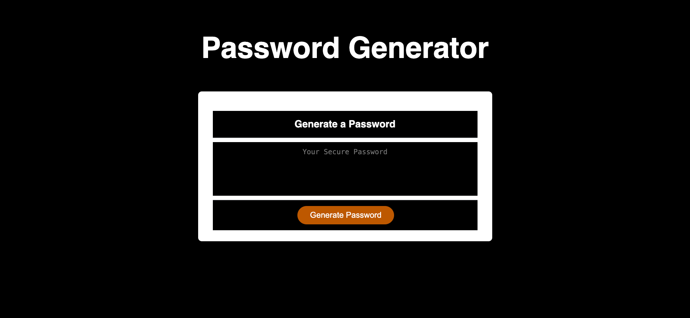

# JavaScrip Random Password Generator

# Description

This week’s challenge required creating an application that an employee can use to generate a random password based on criteria they’ve selected by modifying starter code.
Using intermediate JavaScript, I have created a random password generator.
The application generates a password when the button is clicked and presents a series of prompts including:

- Length of password:

- At least 8 characters but no more than 128.

- Character types: lowercase, uppercase, numeric and special characters ($@%&\*, etc.)

Once all prompts are answered, the password should be generated and displayed in an alert or written to the page.

Live demo: https://grace-apa.github.io/-password-generator/

# Screenshot

